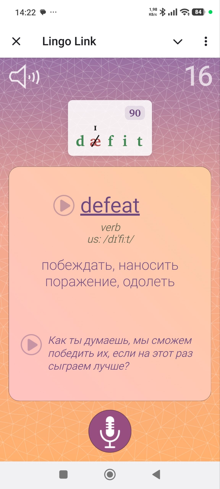

# LingoLink Bot (LLBot)

LingoLink Bot, also known as LLBot, is an open-source Telegram vocabulary-learning bot created by [Aleksei Istomin](https://github.com/alex-ist). It combines a Telegram Mini App, spaced repetition, AI-assisted word processing, dictionary data, speech synthesis, and pronunciation feedback in one learning workflow.

<p align="center">
  
</p>

## Features

- Learn vocabulary with adaptive training cards and progress tracking.
- Use the training interface directly inside Telegram as a Mini App.
- Add, edit, and remove words from a personal vocabulary list.
- Generate translations and level-appropriate example sentences with AI.
- View IPA transcriptions, dictionary references, and pronunciation audio.
- Practice speaking with microphone recording and pronunciation scoring.
- Listen to words and examples using multiple text-to-speech providers.
- Review forgetting statistics after a training session.

## Technology

- Python 3.11+
- `python-telegram-bot`
- `aiohttp` and WebSockets
- SQLite
- OpenAI API
- Google Cloud Translation and Text-to-Speech
- ElevenLabs
- Hugging Face and PyTorch
- HTML, CSS, and JavaScript for the Telegram Mini App

## Project status

LLBot is a personal project. The current source reflects the production application, but some deployment settings are still specific to the original environment.

See [CHANGELOG.md](CHANGELOG.md) for major changes and [TODO.md](TODO.md) for planned work.

## Requirements

Before running LLBot, prepare:

- Python 3.11 or newer;
- a Telegram bot token from BotFather;
- an OpenAI API key;
- a Google Cloud service account with access to the required Translation and Text-to-Speech APIs;
- an ElevenLabs API key;
- a Hugging Face token with access to the pronunciation model.

## Installation

Clone the repository and create an isolated Python environment:

```bash
git clone https://github.com/alex-ist/llbot.git
cd llbot
python3 -m venv .venv
source .venv/bin/activate
python -m pip install --upgrade pip
python -m pip install -r requirements.txt
```

Create an empty SQLite database:

```bash
python scripts/init_db.py
```

The command creates `data/ll.db` from `db/schema.sql` and refuses to overwrite an existing database. The new database contains no users, starter word sets, or dictionary cache data.

## Configuration

Copy the environment template:

```bash
cp .env.example .env
```

Fill in the following variables:

```dotenv
OPENAI_API_KEY=
TELEGRAM_BOT_TOKEN=
LINGOLINK_GOOGLE_SERVICE_ACCOUNT_JSON=
HF_TOKEN=
ELEVENLABS_API_KEY=
```

## Mini App deployment

The static Mini App is located in `web_app/`. It must be served over HTTPS for use inside Telegram.

The backend starts local services for:

- the training WebSocket on `127.0.0.1:8501`;
- generated example audio on `127.0.0.1:8502`.

Before deploying your own instance, replace the deployment-specific Mini App and webhook URLs in `py/run_bot.py`, and configure a reverse proxy for the static files and backend routes.

## Running

Run commands from the repository root so relative data and log paths resolve correctly:

```bash
python py/main.py
```

The application writes logs to `log/ll.log`.

## Tests

Run the current pronunciation-scoring tests with:

```bash
PYTHONPATH=py python -m unittest py/test_pron_scoring.py
```

## Security

- Never commit `.env`, API keys, service-account JSON files, private certificates, or production databases.
- Revoke exposed credentials immediately and replace them with new credentials.
- Keep external-service permissions and usage limits as restrictive as practical.

## Contributing

Issues and pull requests are welcome. For larger changes, open an issue first to discuss the proposed behavior and implementation.

## License

LLBot is available under the [MIT License](LICENSE).
